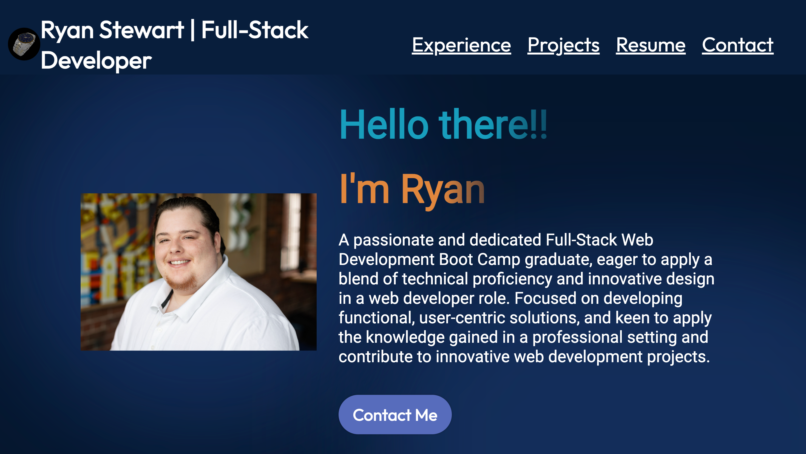
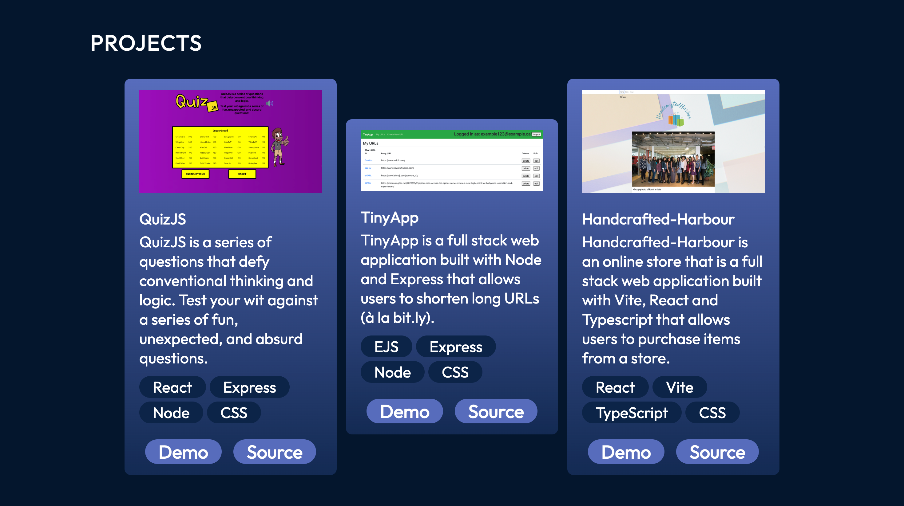
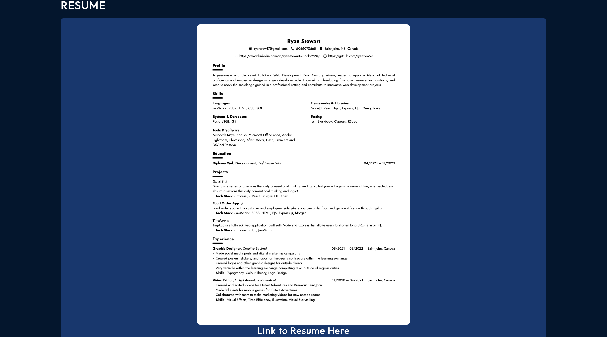

# Ryan's React + Vite Portfolio

## Final Product
## Home

## Experience

## Projects

TINY APP
https://mytinyapp-hasg.onrender.com/register

QUIZ APP
https://gorgeous-donut-33d88d.netlify.app/

ONLINE STORE APP
https://online-store-chi-two.vercel.app/about
## Resume

https://flowcv.com/resume/uhkd2cnhma
## Contact me

ryanstew17@gmail.com

https://www.linkedin.com/in/ryan-stewart-98b3b3220/

https://github.com/ryanstew95
## Dependencies
    - @fontsource/outfit: 5.0.8,

    - @fontsource/roboto: 5.0.8,

    - react: 18.2.0,

    - react-dom: 18.2.0

## Starting the Server
- Install dependencies: npm install
- Run `npm run dev` in Terminal
- Visit: http://localhost:5173